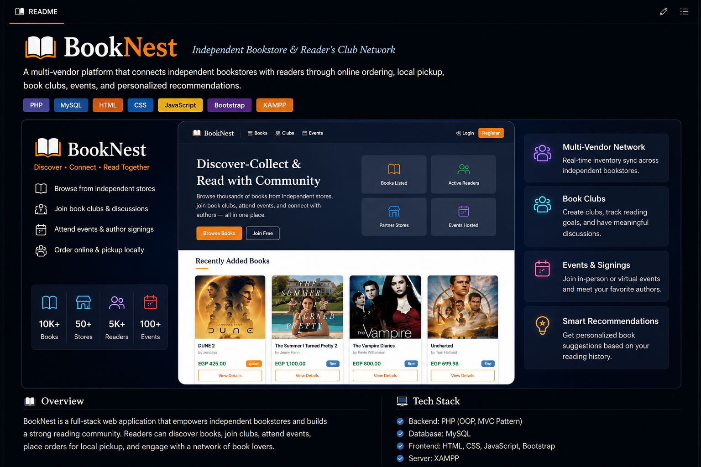

# BookNest

A modern full-stack web application for managing books, reading clubs, events, and online book communities.

---

## Overview

**BookNest** is a multi-vendor web platform that connects independent bookstores with readers in a unified digital ecosystem. It enables users to discover books from local shops, place orders, join reading clubs, attend literary events, and receive personalized recommendations based on reading behavior.

It follows a clean **MVC architecture** with a focus on scalability, maintainability, and real-world system design.

---
## 🎥 Project Walkthrough

[▶️ Watch Demo Video](https://github.com/samasherif-22/BookNest/releases/tag/v1.0)

---
## Features

👤 **Authentication System**
- User registration and login
- Secure session handling
- Role-based access control (Admin / Reader / Author / Club Organizer / BookStore Owner)

---

📖 **Books Management**
- Add, edit, and delete books
- Upload book covers
- View book details
- Browse and search books

---

🏛️ **Clubs System**
- Create and join reading clubs
- Club member management
- Basic discussions inside clubs

---

📅 **Events System**
- Create reading events and book signings
- Join events
- Basic event management and attendance flow

---

🛒 **Orders System**
- Shopping cart functionality
- Checkout process
- Order history tracking

---

🛠️ **Admin Panel**
- Manage users and content
- Manage books and clubs
- Handle reports and disputes
---

🔍 Search System
- Search books by title and author
- AJAX Live Search
- Autocomplete search suggestions
- Real-time search results without page reload
---

## Tech Stack

- PHP (MVC Architecture)
- MySQL
- HTML5 / CSS3 / JavaScript
- XAMPP (Apache Server)

---

